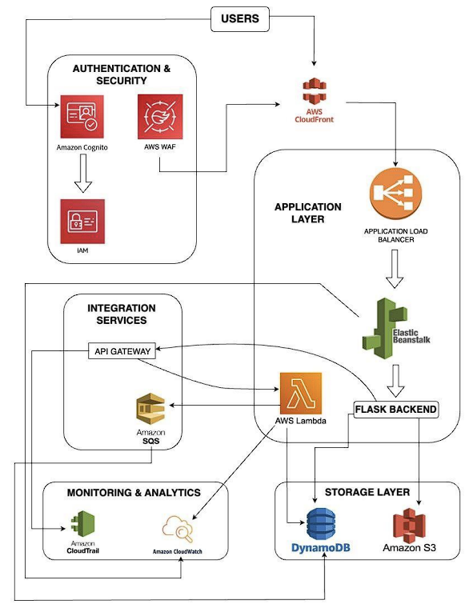
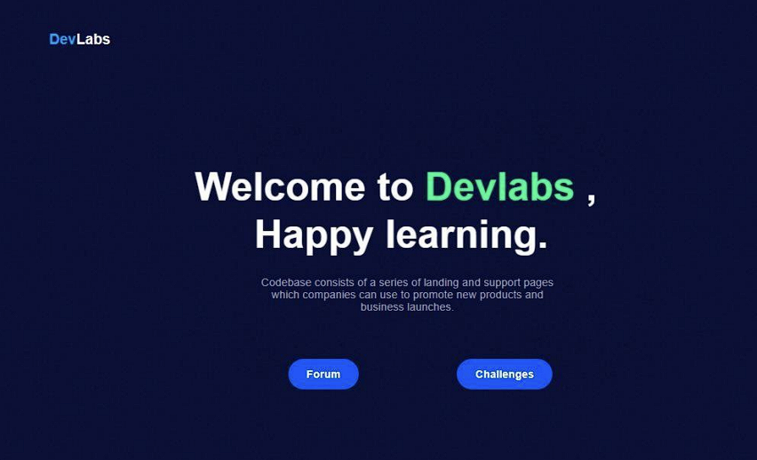
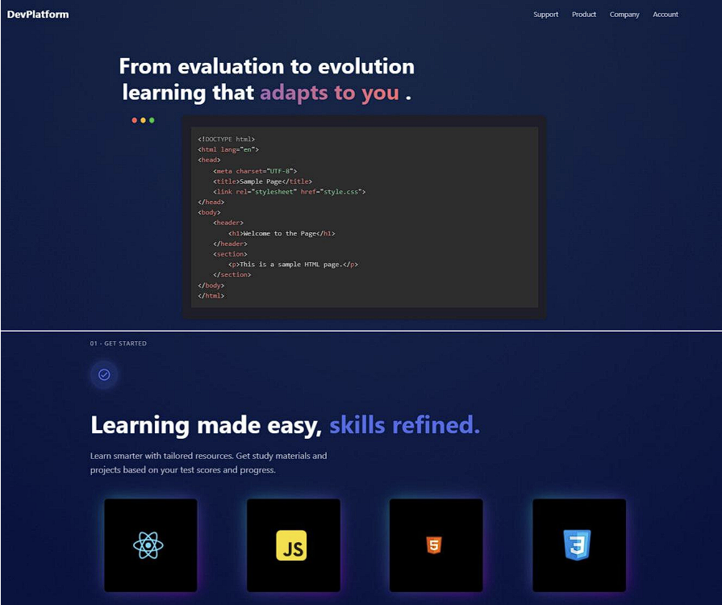
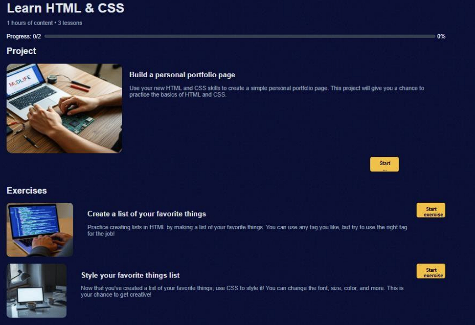
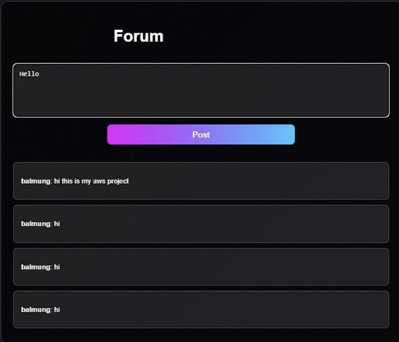
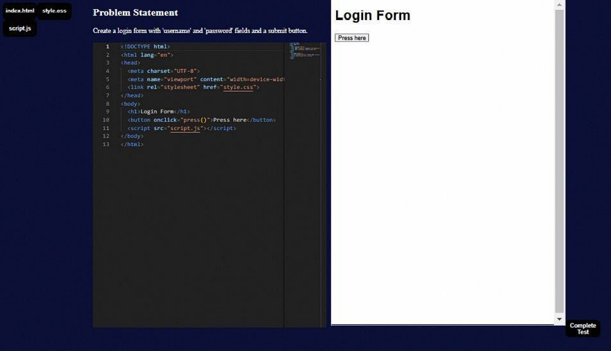
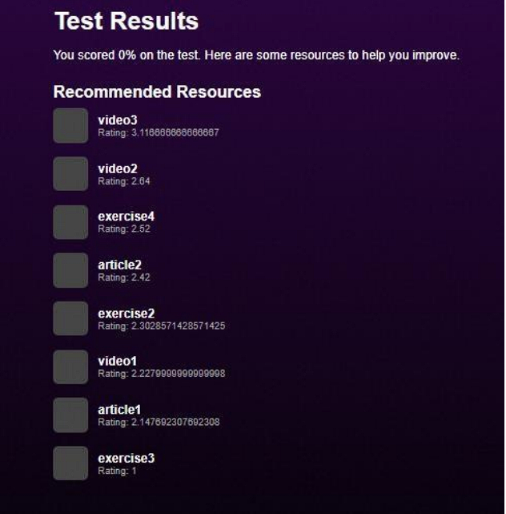

# 🚀 DevLab — Innovative Code Evaluation & Learning Platform

DevLab is an **AWS-powered Ed-Tech platform** for learning modern web development with **interactive coding challenges, real-time feedback, adaptive recommendations,** and a **community forum**. It combines a **React** front-end (with Monaco editor) and a **Node/Express** API with a **headless Chrome (Puppeteer) evaluator**, plus a **Flask** microservice for recommendations—**scalable on AWS**.

---

## 📖 About

DevLab enables learners to practice **HTML, CSS, JavaScript, React, and Tailwind** through hands-on challenges. Submissions are executed and validated in an **isolated headless browser**; learners receive **instant feedback**, **scores**, and **personalized resources**. A simple **forum** fosters collaboration and Q&A.

---

## 🌟 Key Features

- 👤 **Auth & Profiles** — JWT-based auth, user profiles, role flags (user/admin).
- 🧑‍💻 **Monaco Editor Playground** — Real-time code editing with preview.
- 🧪 **Instant Evaluation** — Headless Chrome (Puppeteer) runs custom validation against learner output.
- 🏆 **Challenges & Leaderboard** — Track progress, attempts, and scores.
- 🎯 **Adaptive Recommendations** — Flask microservice returns learning resources based on history.
- 💬 **Discussion Forum** — Post questions, share tips, and discuss solutions.
- 📊 **Analytics** — Progress and usage insights (expandable).
- ☁️ **Cloud-Native** — S3 for assets/CSV, DynamoDB for users/posts, EB/EC2 for API, Amplify for frontend.
- 🔐 **Security-First Defaults** — Env-based secrets, IAM roles, least privilege.

> **Note:** Current evaluator runs on **Node + Puppeteer**. A serverless/Lambda move is on the roadmap.

---

## 🧩 Architecture

  
   
  High-level AWS layout for DevLab.

---
## 🖼️ Demo Walkthrough

> Click any image to view full size. This gallery presents the product flow from sign-up to results.

<table>
  <tr>
    <td align="center" width="33%">
      
       
      <b>1) Registration</b> — Create an account with basic details.
    </td>
    <td align="center" width="33%">
      
       
      <b>2) Login</b> — Secure access to your learning workspace.
    </td>
    <td align="center" width="33%">
      
       
      <b>3) Landing</b> — Welcome page with quick actions & navigation.
    </td>
  </tr>

  <tr>
    <td align="center" width="33%">
      
       
      <b>4) Challenges (I)</b> — Browse curated tasks by topic & difficulty.
    </td>
    <td align="center" width="33%">
      
       
      <b>5) Challenges (II)</b> — View requirements, hints & scoring rules.
    </td>
    <td align="center" width="33%">
      
       
      <b>6) Forum</b> — Discuss problems, share tips, and get help.
    </td>
  </tr>

  <tr>
    <td align="center" width="33%">
      
       
      <b>7) Coding Workspace</b> — Monaco editor with live preview & tests.
    </td>
    <td align="center" width="33%">
      
       
      <b>8) Resource Collection</b> — Add optional study links for guidance.
    </td>
    <td align="center" width="33%">
      
       
      <b>9) Results</b> — Instant feedback, pass/fail status, and next steps.
    </td>
  </tr>
</table>

---
## 🛠 Tech Stack

 

 

 

 

 

  
<b>Frontend</b> — React, Vite/CRA, TailwindCSS, Monaco Editor

  <ul>
    <li>SPA with route guards and layout shells</li>
    <li>Monaco editor playground with live preview</li>
    <li>Utility-first styling via TailwindCSS</li>
  </ul>

  
<b>Backend API</b> — Node.js, Express.js, JSON Web Tokens

  <ul>
    <li>REST endpoints for auth, posts, attempts</li>
    <li>JWT-based sessions and role flags</li>
    <li>Input validation, rate limiting, CORS</li>
  </ul>

  
<b>Evaluator</b> — Puppeteer (headless Chrome)

  <ul>
    <li>Runs user HTML/CSS/JS in sandboxed headless Chrome</li>
    <li>Applies whitelisted validation scripts; returns structured results</li>
    <li>Timeouts and resource limits for safety</li>
  </ul>

  
<b>ML Recommender</b> — Flask (Python)

  <ul>
    <li>Consumes anonymized attempt history & skill tags</li>
    <li>Returns ranked resources from S3-backed catalog</li>
    <li>Pluggable for embeddings or CF later</li>
  </ul>

  
<b>Data</b> — DynamoDB & Amazon S3

  <ul>
    <li><code>users</code>, <code>posts</code>, <code>attempts</code> tables (GSIs for user/challenge lookups)</li>
    <li>S3 for static assets, CSV datasets, screenshots</li>
  </ul>

  
<b>Infra</b> — Elastic Beanstalk, Amplify, CloudWatch/CloudTrail, IAM

  <ul>
    <li>EB for Node API & Flask; Amplify for static frontend</li>
    <li>CloudWatch logs/metrics; CloudTrail auditing</li>
    <li>IAM roles (least privilege) for DynamoDB/S3 access</li>
  </ul>

<!-- Quick summary table for skimmers -->
| 🧩 Layer           | 🛠️ Stack |
|--------------------|----------|
| **Frontend**       | React · Vite/CRA · TailwindCSS · Monaco Editor |
| **Backend API**    | Node.js · Express.js · JWT |
| **Evaluator**      | Puppeteer (headless Chrome) |
| **ML Recommender** | Flask (Python) |
| **Data**           | DynamoDB (Users, Posts, Attempts) · Amazon S3 (assets/CSV) |
| **Infra**          | Elastic Beanstalk (API & Flask) · Amplify (Frontend) · CloudWatch/CloudTrail · IAM |

---

## 📚 References

### Research & Articles

- [Springer Chapter](https://link.springer.com/chapter/10.1007/978-981-97-1329-5_28)
- [IEEE Xplore — Document 10497289](https://ieeexplore.ieee.org/document/10497289)
- [IEEE Xplore — Document 10426375](https://ieeexplore.ieee.org/abstract/document/10426375)
- [arXiv Preprint](https://arxiv.org/abs/2307.08705)
- [Springer Chapter](https://link.springer.com/chapter/10.1007/978-3-030-60036-5_3)
- [Journal of Cloud Computing (SpringerOpen)](https://journalofcloudcomputing.springeropen.com/articles/10.1186/s13677-019-0134-y)

> *Some resources (Springer, IEEE Xplore) may require institutional access.*

---

### AWS Services Documentation
- [Amazon EC2 — Concepts](https://docs.aws.amazon.com/AWSEC2/latest/UserGuide/concepts.html)
- [Amazon CloudWatch — Docs](https://docs.aws.amazon.com/cloudwatch/)
- [AWS Elastic Beanstalk — Docs](https://docs.aws.amazon.com/elasticbeanstalk/)
- [Amazon DynamoDB — Docs](https://docs.aws.amazon.com/dynamodb/)
- [AWS DevOps Blog — Complete CI/CD with CodeCommit, CodeBuild, CodeDeploy & CodePipeline](https://aws.amazon.com/blogs/devops/complete-ci-cd-with-aws-codecommit-awscodebuild-aws-codedeploy-and-aws-codepipeline/)
- [Amazon S3 — Docs](https://docs.aws.amazon.com/s3/)
- [AWS Amplify — Docs](https://docs.amplify.aws/)
- [AWS IAM — Docs](https://docs.aws.amazon.com/IAM/latest/UserGuide/introduction.html)
